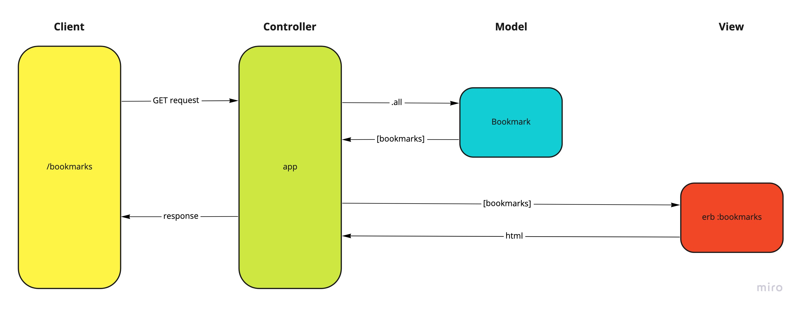

# Week-6-Databases

## Show All Bookmarks
Show a list of bookmarks

As a user of the internet

So that I can review webpages that I've saved

I'd like to view a list of my saved bookmarks

## Database setup instructions:
  1. Connect to psql
  2. Create the database using the psql command CREATE DATABASE bookmark_manager;
  3. Connect to the database using the pqsl command \c bookmark_manager;
  4. Run the query we have saved in the file 01_create_bookmarks_table.sql

## Creating a test database
	1. Connect to psql
  2. Create the database using the psql command CREATE DATABASE bookmark_manager_test;
  3. Connect to the database using the pqsl command \c bookmark_manager_test;
  4. Run the query we have saved in the file 01_create_bookmarks_table.sql